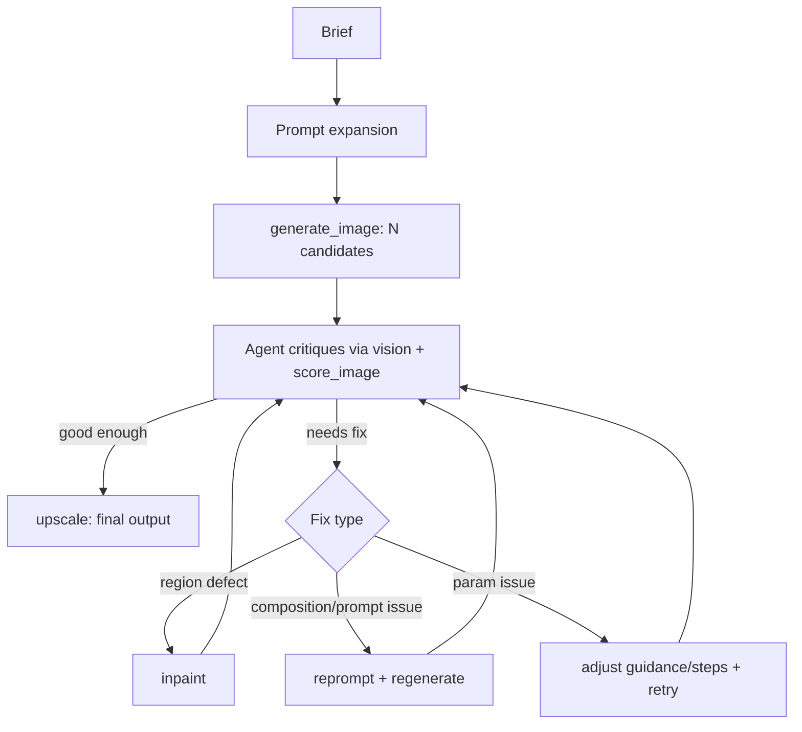

# art-director-agent

A closed-loop image generation agent. Instead of one-shot prompting, the agent
generates, looks at its own output, diagnoses what's wrong against the brief,
and calls a fix tool — until the result actually matches, or it hits its
iteration cap.

<!-- Replace with a real before/after grid or GIF once the loop works.
     This is the single most important image in this README — a recruiter
     who sees the agent catch and fix a defect will read the rest. -->


## Why this exists

Most "AI image generator" portfolio projects are a prompt box wired to an API.
This one is closer to what production generative systems actually need: a way
to know when the output is wrong and a mechanism to correct it, instead of
hoping the first sample is good. That's the same evaluation-first thinking
behind [agentic-rag-eval](../agentic-rag-eval), applied to a visual domain.

## How it works

1. Brief comes in → agent expands it into a full SDXL prompt (positive + negative)
2. `generate_image` produces 2–3 candidates at different seeds
3. Agent (using vision) inspects each candidate and diagnoses specific defects
   — malformed hands, wrong composition, background mismatch
4. Agent picks a fix: reprompt + regenerate, `inpaint` the bad region, or
   adjust guidance/steps and retry
5. `score_image` gives a numeric signal (CLIP alignment) alongside the
   agent's own visual judgment
6. Repeat until the score clears the bar or the iteration cap is hit
7. `upscale` the winner



## Architecture

- **MCP server** (`mcp_server/`) — exposes `generate_image`, `inpaint`,
  `upscale`, `score_image`, `get_history` as tools
- **Pipeline** (`pipeline/`) — diffusers wrapper around SDXL base + refiner
- **Eval** (`eval/`) — CLIP-based scoring + per-iteration logging
- **Demo** (`demo/`) — Streamlit app replaying the iteration history

See `docs/CONTEXT.md` for domain vocabulary and `docs/adr/` for why specific
decisions were made (tool granularity, scoring method, iteration cap).

## Results

<!-- This table is the actual evidence. Fill it in from docs/EVAL.md's
     benchmark set — single-shot generation vs the full critique loop,
     on the same fixed prompt set. Don't publish adjectives, publish numbers. -->

| Condition | Avg. CLIP score | Avg. iterations | Avg. latency | Human pass rate |
|---|---|---|---|---|
| Single-shot (no loop) | — | 1 | — | —% |
| Full critique loop | — | — | — | —% |

Full methodology: [`docs/EVAL.md`](docs/EVAL.md)

## Setup

```bash
# clone, then:
python -m venv .venv && source .venv/bin/activate
pip install -e ".[dev]"
python -m mcp_server.server   # starts the MCP server
streamlit run demo/app.py     # starts the demo
```

Requires a CUDA GPU (or a hosted inference endpoint — see `docs/adr/` for
which one and why) for SDXL inference at reasonable speed.

## Tech stack

Python, diffusers, MCP, Claude (vision + tool use), CLIP, Streamlit.

## What I learned

<!-- This section matters more than it looks. Write it last, after building —
     specific technical lessons, not "I learned a lot." E.g.: "The agent's
     own critique was unreliable below X guidance scale — added score_image
     as a check because vision-only judgment disagreed with itself across
     runs on ambiguous cases." -->

- TBD

## Roadmap

- [ ] Adversarial critic (separate agent grading generation, not self-graded)
- [ ] ControlNet for pose/composition-constrained generation
- [ ] Batch benchmark mode for the eval set

## License

MIT — see [LICENSE](LICENSE).
