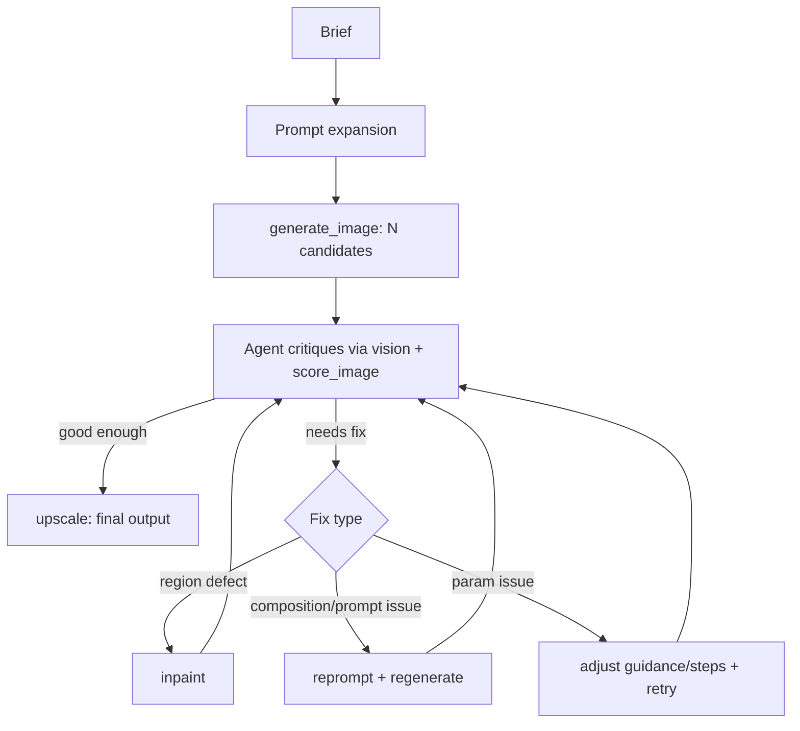

# art-director-agent

A closed-loop image generation agent. Instead of one-shot prompting, the agent
generates, looks at its own output, diagnoses what's wrong against the brief,
and calls a fix tool — until the result actually matches, or it hits its
iteration cap.

| Candidate A — rejected | Candidate B — accepted, upscaled |
|---|---|
|  |  |

Real session, no cherry-picking beyond picking which of three ran sessions to lead with (see [Results](#results)): `generate_image` produced two candidates for the same prompt and seed family; the agent's vision critique caught that Candidate A cropped the subject's face out of frame, picked Candidate B, and `upscale`d it. The other two sessions in [Results](#results) show the harder, more honest cases — a hand defect that survived three fix attempts, and a text-rendering failure that survived a reprompt.

## Why this exists

Most "AI image generator" portfolio projects are a prompt box wired to an API.
This one is closer to what production generative systems actually need: a way
to know when the output is wrong and a mechanism to correct it, instead of
hoping the first sample is good. That's the same evaluation-first thinking
behind [agentic-rag-eval](../agentic-rag-eval), applied to a visual domain.

## How it works

1. Brief comes in → agent expands it into a full SDXL prompt (positive + negative)
2. `generate_image` produces 2–3 candidates at different seeds
3. Agent (using vision) inspects each candidate and diagnoses specific defects
   — malformed hands, wrong composition, background mismatch
4. Agent picks a fix: reprompt + regenerate, `inpaint` the bad region, or
   adjust guidance/steps and retry
5. `score_image` gives a numeric signal (CLIP alignment) alongside the
   agent's own visual judgment
6. Repeat until the score clears the bar or the iteration cap is hit
7. `upscale` the winner



## Architecture

- **MCP server** (`mcp_server/`) — exposes `generate_image`, `inpaint`,
  `upscale`, `score_image`, `get_history` as tools
- **Pipeline** (`pipeline/`) — diffusers wrapper around SDXL base + refiner
- **Eval** (`eval/`) — CLIP-based scoring + per-iteration logging
- **Demo** (`demo/`) — Streamlit app replaying curated sessions from
  `demo/examples/` (a hand-picked, committed subset — the full session logs
  in `eval/results/` are gitignored, generated locally)

See `docs/CONTEXT.md` for domain vocabulary and `docs/adr/` for why specific
decisions were made (tool granularity, scoring method, iteration cap).

## Results

`docs/EVAL.md`'s full single-shot-vs-loop benchmark, run for real on the RTX
5070 Ti: 24 fixed prompts (`eval/benchmark_prompts.json`) across all four
failure categories, under both conditions. Every full-loop session was
reviewed by the orchestrating agent (vision critique, not just CLIP); a
sample of single-shot results was human-spot-checked, matching `EVAL.md`'s
own guidance on honest small-sample reporting.

| Condition | Avg. CLIP score | Avg. iterations | Avg. latency | Human pass rate |
|---|---|---|---|---|
| Single-shot (no loop) | 28.5 | 1 | 11.6s | 62.5% (5/8 spot-checked) |
| Full critique loop | 28.9 | 1.17 | — | 87.5% (21/24, every session reviewed) |

CLIP score barely moves between conditions — expected, given ADR 0004's whole
point is that CLIP doesn't reliably detect the defects that matter. The real
effect is in pass rate: the loop's ability to pick the better of multiple
candidates, or fix a diagnosed defect, pushes it from roughly 3-in-5 to
roughly 7-in-8.

By category (full loop):

| Category | Avg. CLIP | Avg. rounds | Note |
|---|---|---|---|
| Hands | 26.5 | 1.00 | No fixes needed in this sample — defects showed up in multi-person compositions (an extra hand, a third limb), not simple single-hand grips |
| Multi-object | 31.6 | 1.17 | One genuine count defect (4 cats generated for a "three cats" brief, in *both* candidates) — reprompt fixed it |
| Text | 26.3 | 1.50 | Heaviest use of the fix loop — 3/6 needed reprompting; every reprompt improved the result, but only fully resolved it in half of those cases |
| Style/mood | 31.2 | 1.00 | No fixes needed — subjective quality was already strong single-shot |

Raw per-prompt data: [`eval/results/single_shot_benchmark.json`](eval/results/single_shot_benchmark.json),
[`eval/results/full_loop_benchmark.json`](eval/results/full_loop_benchmark.json).
Three of those full-loop sessions, replayable round-by-round with images:
`streamlit run demo/app.py`.

Full benchmark methodology (not yet run at scale): [`docs/EVAL.md`](docs/EVAL.md)

## Setup

```bash
# clone, then:
python -m venv .venv && source .venv/bin/activate
pip install -e ".[dev]"
python -m mcp_server.server   # starts the MCP server — needs a CUDA GPU (ADR 0002)
streamlit run demo/app.py     # starts the demo — replay only, no GPU needed
```

Live generation (`mcp_server.server`) requires a CUDA GPU — this project runs
against a local RTX 5070 Ti (16GB), see `docs/adr/0002-local-inference-hosting.md`
for the VRAM budget and why hosted inference wasn't used.

**Running the loop interactively:** `.mcp.json` registers the server for
MCP clients that auto-discover project config (Claude Code, Claude Desktop).
Point your client at this repo, start (or restart) it, and just describe a
brief — the agent calls `generate_image`/`inpaint`/`upscale`/`score_image`
as real tools and critiques the results with vision, live, the same loop
`docs/EVAL.md`'s benchmark ran 24 times.

The **demo is a replay viewer**, not a live generator (ADR 0011) — it only
reads the curated sessions in `demo/examples/`, so it needs no GPU and is
deployable anywhere Streamlit runs, e.g.
[Streamlit Community Cloud](https://streamlit.io/cloud): push this repo to
GitHub, point Community Cloud at it, set the app file to `demo/app.py`. No
secrets or GPU access required.

## Tech stack

Python, diffusers, MCP, Claude (vision + tool use), CLIP, Streamlit.

## What I learned

- **CLIP score is a genuinely weak proxy for structural defects, not just a hypothetical concern.** In the handshake session, the highest-scoring candidate across all 5 rounds (27.9) was the one with visibly fused fingers — cleaner-looking later attempts scored lower. This is the concrete evidence behind ADR 0004's decision to make `score_image` advisory rather than a gate, found by running the system, not predicted in advance.
- **Reusing the base pipeline for inpainting (ADR 0008, to stay inside the VRAM budget) has a real quality ceiling.** 3 separate inpaint attempts on the same hand defect, with different seeds and step counts, never reliably converged. A dedicated inpainting-finetuned checkpoint is the next thing to try if fix quality matters more than the VRAM saved — that revisit trigger is already written into the ADR.
- **Text-in-image is a base-model problem, but reprompting still helps more than expected.** Across the 24-prompt benchmark, every reprompt attempt on garbled text measurably improved it — a fully illegible cake message became "BIRTHDDAY" (one extra letter), an unreadable menu's headline became a clean "COFFEE" — but only half of those attempts reached a fully correct result. Worth the fix budget, not a guaranteed fix.
- **The loop's real value shows up as pass rate, not CLIP score.** Across the full 24-prompt benchmark, CLIP score barely differs between single-shot and full-loop (28.5 vs 28.9) — expected, since ADR 0004's whole premise is that CLIP misses what matters. Human-judged pass rate is where the gap is real: ~62.5% single-shot vs. ~87.5% full-loop, almost entirely from picking the better of multiple candidates or fixing a diagnosed defect, not from the score improving.
- **Hand defects cluster in multi-person compositions, not simple grips.** All 6 "hands" prompts needed zero fixes when the shot was one person's hand (typing, gripping a rock face); the actual defects — an extra hand near a violin's scroll, a third limb fragment at a frame edge — showed up specifically when multiple hands/arms overlapped in frame. A narrower, more useful mental model than "SDXL is bad at hands" going in.
- **My own vision-based defect diagnosis was wrong twice on the same image**, misreading a fused-finger region as fixed when it wasn't (caught by a second reviewer, not by `score_image` — which also scored that image highest). A single vision pass isn't a reliable ground truth either; this is worth remembering before trusting any one critique signal too far, agent or metric.

## Roadmap

- [x] Run `docs/EVAL.md`'s full single-shot-vs-loop benchmark — see Results
- [ ] Dedicated inpainting-finetuned checkpoint, if the shared-component
      pipeline's hand-fix quality ceiling (see What I learned) turns out to
      matter more than the VRAM it saves (ADR 0008)
- [ ] Adversarial critic (separate agent grading generation, not self-graded)
- [ ] ControlNet for pose/composition-constrained generation
- [ ] Batch benchmark mode for the eval set

## License

MIT — see [LICENSE](LICENSE).
