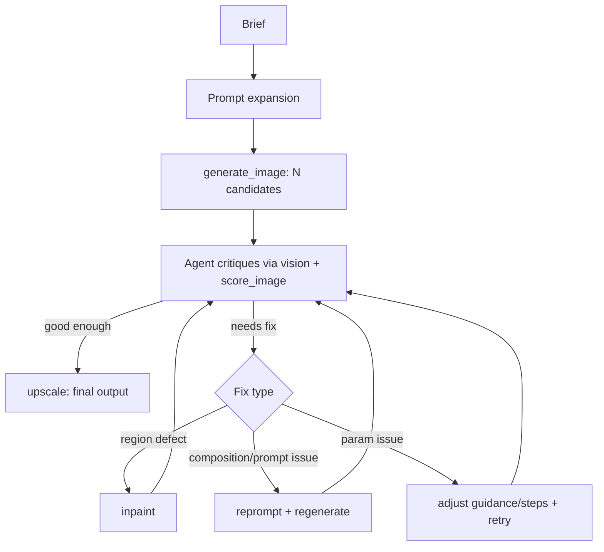

# art-director-agent

A closed-loop image generation agent. Instead of one-shot prompting, the agent
generates, looks at its own output, diagnoses what's wrong against the brief,
and calls a fix tool — until the result actually matches, or it hits its
iteration cap.

| Candidate A — rejected | Candidate B — accepted, upscaled |
|---|---|
|  |  |

Real session, no cherry-picking beyond picking which of three ran sessions to lead with (see [Results](#results)): `generate_image` produced two candidates for the same prompt and seed family; the agent's vision critique caught that Candidate A cropped the subject's face out of frame, picked Candidate B, and `upscale`d it. The other two sessions in [Results](#results) show the harder, more honest cases — a hand defect that survived three fix attempts, and a text-rendering failure that survived a reprompt.

## Why this exists

Most "AI image generator" portfolio projects are a prompt box wired to an API.
This one is closer to what production generative systems actually need: a way
to know when the output is wrong and a mechanism to correct it, instead of
hoping the first sample is good. That's the same evaluation-first thinking
behind [agentic-rag-eval](../agentic-rag-eval), applied to a visual domain.

## How it works

1. Brief comes in → agent expands it into a full SDXL prompt (positive + negative)
2. `generate_image` produces 2–3 candidates at different seeds
3. Agent (using vision) inspects each candidate and diagnoses specific defects
   — malformed hands, wrong composition, background mismatch
4. Agent picks a fix: reprompt + regenerate, `inpaint` the bad region, or
   adjust guidance/steps and retry
5. `score_image` gives a numeric signal (CLIP alignment) alongside the
   agent's own visual judgment
6. Repeat until the score clears the bar or the iteration cap is hit
7. `upscale` the winner



## Architecture

- **MCP server** (`mcp_server/`) — exposes `generate_image`, `inpaint`,
  `upscale`, `score_image`, `get_history` as tools
- **Pipeline** (`pipeline/`) — diffusers wrapper around SDXL base + refiner
- **Eval** (`eval/`) — CLIP-based scoring + per-iteration logging
- **Demo** (`demo/`) — Streamlit app replaying curated sessions from
  `demo/examples/` (a hand-picked, committed subset — the full session logs
  in `eval/results/` are gitignored, generated locally)

See `docs/CONTEXT.md` for domain vocabulary and `docs/adr/` for why specific
decisions were made (tool granularity, scoring method, iteration cap).

## Results

Three real sessions, run end-to-end through the actual MCP tools on an RTX 5070
Ti — not `docs/EVAL.md`'s full single-shot-vs-loop benchmark (that needs a
~20-30 prompt set run under both conditions; not done yet, see Roadmap). This
is a small sample demonstrating the mechanism, reported honestly rather than
extrapolated: 3 sessions is evidence the loop works, not evidence of a
pass rate.

| Session | Rounds used | Outcome | Best CLIP score | What happened |
|---|---|---|---|---|
| "woman holding a bouquet of flowers..." | 1 / 5 | **Accepted**, upscaled | 32.6 | One candidate had a composition defect (face cropped out of frame); the agent picked the other without needing a fix round |
| "two business people shaking hands..." | 5 / 5 (cap-out) | **Not confirmed** — best-scoring round returned, flagged | 27.9 | 3 inpaint attempts on a hand defect; the highest-CLIP-scoring result was actually the *worst*-looking one (fused fingers) — a real instance of the CLIP blind spot `docs/EVAL.md` predicted |
| "vintage neon sign that says OPEN..." | 2 / 5 | Not upscaled — stopped early | 33.1 | "OPEN" rendered correctly, but secondary signage was gibberish in every attempt, including after a reprompt — a base-model text-rendering limit, not something this project's fix taxonomy addresses |

Replay all three, round by round: `streamlit run demo/app.py`.

Full benchmark methodology (not yet run at scale): [`docs/EVAL.md`](docs/EVAL.md)

## Setup

```bash
# clone, then:
python -m venv .venv && source .venv/bin/activate
pip install -e ".[dev]"
python -m mcp_server.server   # starts the MCP server — needs a CUDA GPU (ADR 0002)
streamlit run demo/app.py     # starts the demo — replay only, no GPU needed
```

Live generation (`mcp_server.server`) requires a CUDA GPU — this project runs
against a local RTX 5070 Ti (16GB), see `docs/adr/0002-local-inference-hosting.md`
for the VRAM budget and why hosted inference wasn't used.

The **demo is a replay viewer**, not a live generator (ADR 0011) — it only
reads the curated sessions in `demo/examples/`, so it needs no GPU and is
deployable anywhere Streamlit runs, e.g.
[Streamlit Community Cloud](https://streamlit.io/cloud): push this repo to
GitHub, point Community Cloud at it, set the app file to `demo/app.py`. No
secrets or GPU access required.

## Tech stack

Python, diffusers, MCP, Claude (vision + tool use), CLIP, Streamlit.

## What I learned

- **CLIP score is a genuinely weak proxy for structural defects, not just a hypothetical concern.** In the handshake session, the highest-scoring candidate across all 5 rounds (27.9) was the one with visibly fused fingers — cleaner-looking later attempts scored lower. This is the concrete evidence behind ADR 0004's decision to make `score_image` advisory rather than a gate, found by running the system, not predicted in advance.
- **Reusing the base pipeline for inpainting (ADR 0008, to stay inside the VRAM budget) has a real quality ceiling.** 3 separate inpaint attempts on the same hand defect, with different seeds and step counts, never reliably converged. A dedicated inpainting-finetuned checkpoint is the next thing to try if fix quality matters more than the VRAM saved — that revisit trigger is already written into the ADR.
- **Text-in-image isn't a "fix" problem, it's a base-model problem.** Reprompting regenerated the whole scene and still produced gibberish secondary signage. This project's Fix mapping (`docs/CONTEXT.md`) has no category for "the model can't render text reliably" — `docs/EVAL.md` predicted this exact failure mode before any code was written, and it held up.
- **My own vision-based defect diagnosis was wrong twice on the same image**, misreading a fused-finger region as fixed when it wasn't (caught by a second reviewer, not by `score_image` — which also scored that image highest). A single vision pass isn't a reliable ground truth either; this is worth remembering before trusting any one critique signal too far, agent or metric.

## Roadmap

- [ ] Run `docs/EVAL.md`'s full single-shot-vs-loop benchmark (~20-30 prompts,
      both conditions) — the 3-session sample above shows the mechanism works,
      not a pass rate
- [ ] Dedicated inpainting-finetuned checkpoint, if the shared-component
      pipeline's hand-fix quality ceiling (see What I learned) turns out to
      matter more than the VRAM it saves (ADR 0008)
- [ ] Adversarial critic (separate agent grading generation, not self-graded)
- [ ] ControlNet for pose/composition-constrained generation
- [ ] Batch benchmark mode for the eval set

## License

MIT — see [LICENSE](LICENSE).
